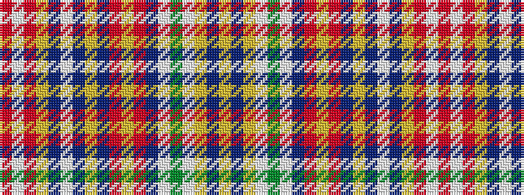

RWRYBWBYBRYRBWGWYBY

It is a 19 stripe tartan.

<figure class="pat-woven">

<figcaption>idealised sample</figcaption>
</figure>

## Colour Sequence



## Tartans with this colour sequence

| Tartans |
|---------------|
| [Hébert Kitenge Family (Personal)](/variants/s19/r15w2r15ly1dt8w2dt8ly1dt12r1ly3r1dt12w2g20w2ly1dt20ly1~x2/)|
||
