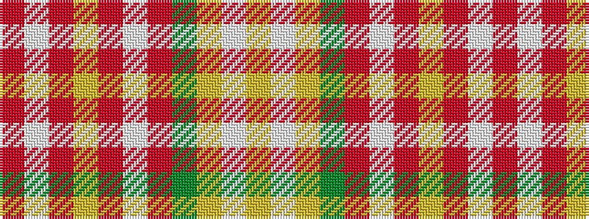

RWRYRWRGYWY

It is a 11 stripe tartan.

<figure class="pat-woven">

<figcaption>idealised sample</figcaption>
</figure>

## Colour Sequence



## Tartans with this colour sequence

| Tartans |
|---------------|
| [MacKellar Dress (Reproduction colours)](/setts/s11/o35w4o3ly7o3w4o7dy15lr4w36lr5~x2/)|
||
