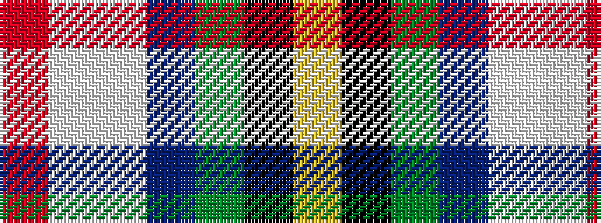

RWWBGKY

It is a 7 stripe tartan.

<figure class="pat-woven">

<figcaption>idealised sample</figcaption>
</figure>

## Colour Sequence



## Tartans with this colour sequence

| Tartans |
|---------------|
| [Pincock (Name)](/setts/s7/r2w1lb50t24g12k1ly1~x2/)|
||
| [Pincock (Plockton), Dougie](/setts/s7/r2w1lt50db24g12k1ly1~x2/)|
||
