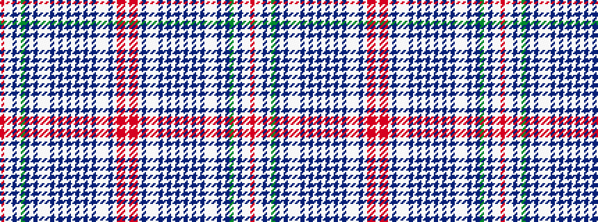

RWWBWGBWBWWWBWBWBWBWBWBWWWBWRRW

It is a 31 stripe tartan.

<figure class="pat-woven">

<figcaption>idealised sample</figcaption>
</figure>

## Colour Sequence



## Tartans with this colour sequence

| Tartans |
|---------------|
| [Brides Plaid](/variants/s31/r4w1lb2dp4w1dg2db8w1dp2lb2w1lb2dp2w1dp16w1dp6w1dp6w1dp16w1dp2lb2w1lb2dp2w1r8ri6w1~x2/)|
||
