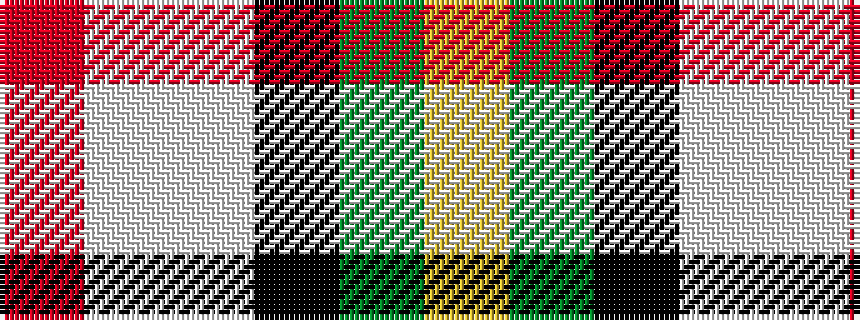

RWWKGY

It is a 6 stripe tartan.

<figure class="pat-woven">

<figcaption>idealised sample</figcaption>
</figure>

## Colour Sequence



## Tartans with this colour sequence

| Tartans |
|---------------|
| [Ball Hunting](/variants/s6/lo13g8k5lb3w2r1~x4/)|
||
