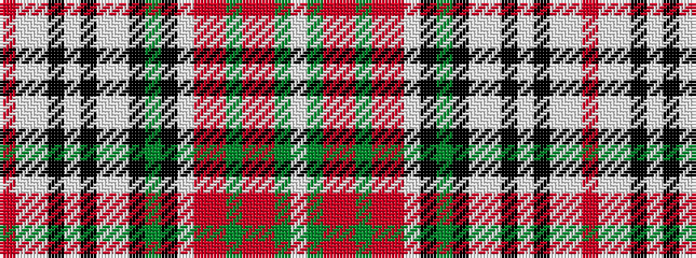

RWWKWKWWKGKWRRGRRGW

It is a 19 stripe tartan.

<figure class="pat-woven">

<figcaption>idealised sample</figcaption>
</figure>

## Colour Sequence



## Tartans with this colour sequence

| Tartans |
|---------------|
| [McBain](/variants/s19/ri60w2lb5k2w2k2lb5w2k2g12k2w2ri5r5g2r5ri5g10w2~x2/)|
||
