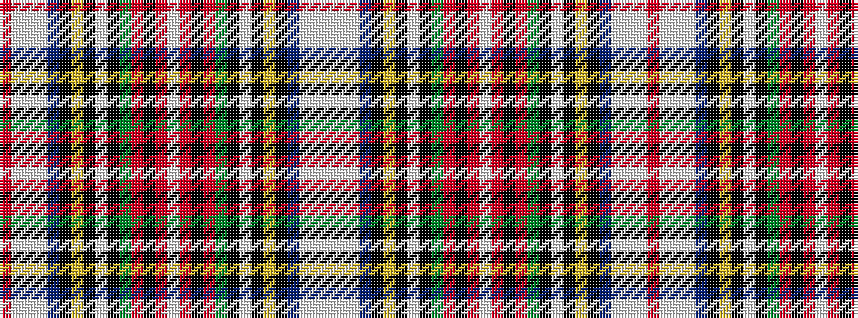

RWWWBKYKWKGRKRWRKRGKWKYKBWWW

It is a 28 stripe tartan.

<figure class="pat-woven">

<figcaption>idealised sample</figcaption>
</figure>

## Colour Sequence



## Tartans with this colour sequence

| Tartans |
|---------------|
| [Hay-Stewart](/setts/s28/r4w3w18w4b4k6ly2k2w2k2dg8r4k2r4w2~x2/)|
||
