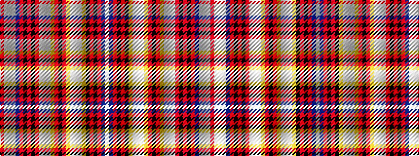

RWWWBRKRKRWWWYRKRYWWWYKRKRBW

It is a 28 stripe tartan.

<figure class="pat-woven">

<figcaption>idealised sample</figcaption>
</figure>

## Colour Sequence



## Tartans with this colour sequence

| Tartans |
|---------------|
| [Kinross #2](/variants/s28/o36lb1lbi6lb1db8r4k4r24k4o8lb1lbi6lb1lo18o6k4o6lo18lb1lbi6lb1lo8k4o24k4o4db8lb4~x2/)|
||
