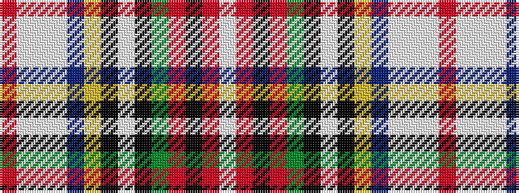

RWWWBYKWKGRKRW

It is a 14 stripe tartan.

<figure class="pat-woven">

<figcaption>idealised sample</figcaption>
</figure>

## Colour Sequence



## Tartans with this colour sequence

| Tartans |
|---------------|
| [Albert (Silk)](/variants/s14/r2lb11w4lb5db6ly1k1w1k1g8r8k1r4w1~x2/)|
||
