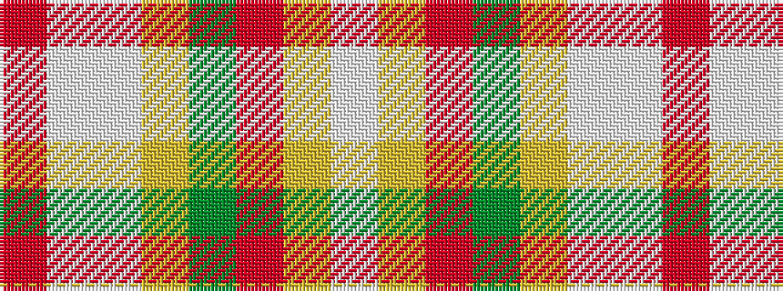

RWWYGRYW

It is a 8 stripe tartan.

<figure class="pat-woven">

<figcaption>idealised sample</figcaption>
</figure>

## Colour Sequence



## Tartans with this colour sequence

| Tartans |
|---------------|
| [Takashimaya Dm Rose](/setts/s8/m4lb2w11ly9y16o16ly2lb4~x2/)|
||
