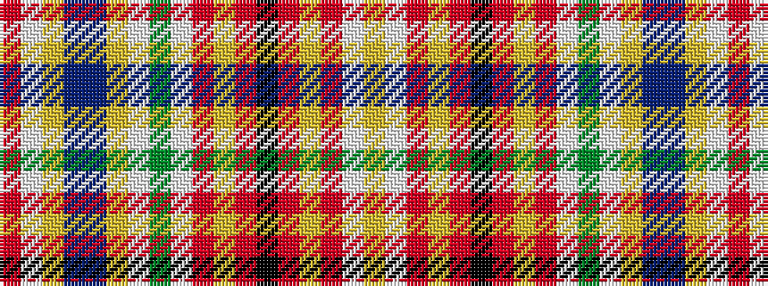

RWYBBYWGWRYRKRYRWY

It is a 18 stripe tartan.

<figure class="pat-woven">

<figcaption>idealised sample</figcaption>
</figure>

## Colour Sequence



## Tartans with this colour sequence

| Tartans |
|---------------|
| [Campbell, New Louden](/variants/s18/r25w2lo5t2db2lo5w2g12w2m2lo2r5k2r5lo2m2w2lo9~x2/)|
||
