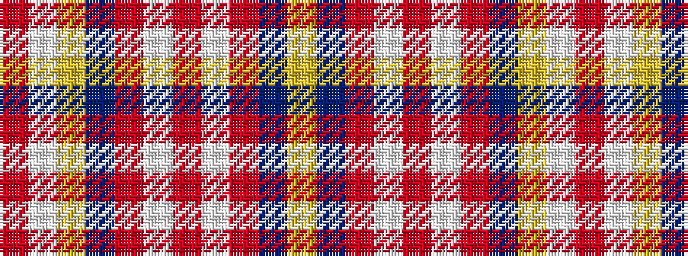

RWYBRWRWRBY

It is a 11 stripe tartan.

<figure class="pat-woven">

<figcaption>idealised sample</figcaption>
</figure>

## Colour Sequence



## Tartans with this colour sequence

| Tartans |
|---------------|
| [Kuehle Hunting (Personal)](/variants/s11/lo30db6m1w2m6w2m1db6lo30lb1r3~x2/)|
||
