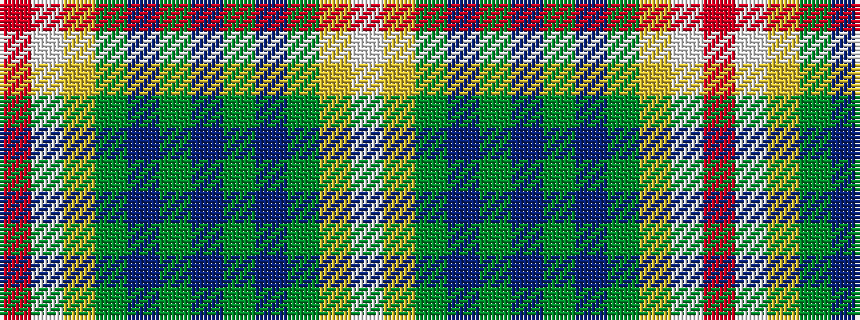

RWYGBGBGBGYW

It is a 12 stripe tartan.

<figure class="pat-woven">

<figcaption>idealised sample</figcaption>
</figure>

## Colour Sequence



## Tartans with this colour sequence

| Tartans |
|---------------|
| [Walter (Personal)](/variants/s12/r24w3ly4dg18dp18y3t4~x2/)|
||
