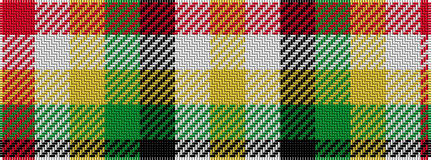

RWYGKWY

It is a 7 stripe tartan.

<figure class="pat-woven">

<figcaption>idealised sample</figcaption>
</figure>

## Colour Sequence



## Tartans with this colour sequence

| Tartans |
|---------------|
| [MacLachlan #4](/variants/s7/r24w2ly3dg16k16w2ly3~x2/)|
||
| [MacLachlan Old Clan Tartan](/variants/s7/r24w2ly3g16k16w2ly3~x2/)|
||
| [MacLachlan W](/variants/s7/r24lb2ly3dg16k16lb2ly3/)|
||
