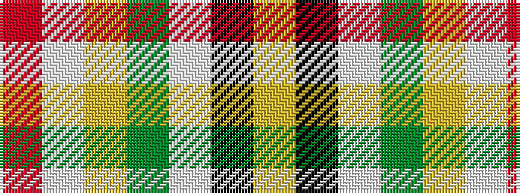

RWYGWKY

It is a 7 stripe tartan.

<figure class="pat-woven">

<figcaption>idealised sample</figcaption>
</figure>

## Colour Sequence



## Tartans with this colour sequence

| Tartans |
|---------------|
| [MacLachlan Dress](/setts/s7/r36w3lo4g24w24k3lo6~x2/)|
||
