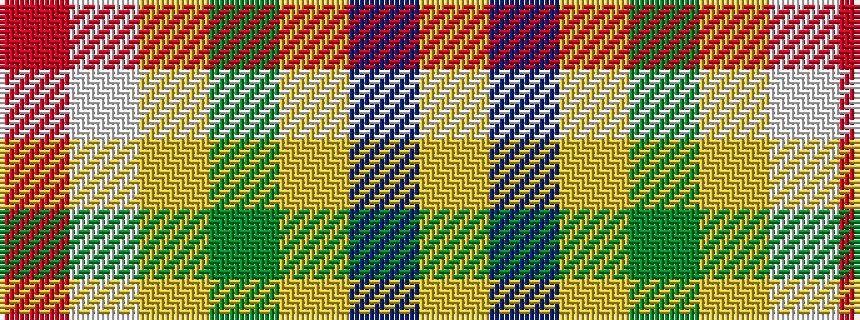

RWYGYBY

It is a 7 stripe tartan.

<figure class="pat-woven">

<figcaption>idealised sample</figcaption>
</figure>

## Colour Sequence



## Tartans with this colour sequence

| Tartans |
|---------------|
| [Fraser Yellow](/setts/s7/r2w2ly27dg14ly2db14ly2~x2/)|
||
| [Fraser, Yellow](/setts/s7/r2w2ly27g14ly2db14ly2~x2/)|
||
