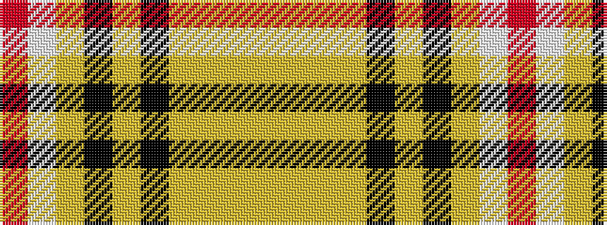

RWYKYKYYYY

It is a 10 stripe tartan.

<figure class="pat-woven">

<figcaption>idealised sample</figcaption>
</figure>

## Colour Sequence



## Tartans with this colour sequence

| Tartans |
|---------------|
| [Sutherland of Duffus (Clan)](/variants/s10/r22lb3lo14k3lo14k3lo14ly3lo14ly3~x2/)|
||
