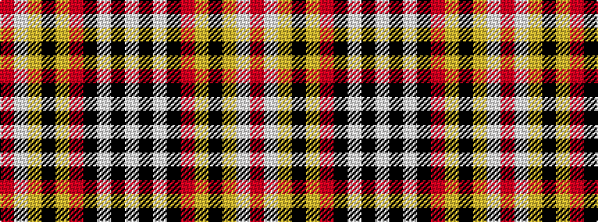

RWYKYRKWKW

It is a 10 stripe tartan.

<figure class="pat-woven">

<figcaption>idealised sample</figcaption>
</figure>

## Colour Sequence



## Tartans with this colour sequence

| Tartans |
|---------------|
| [Sens](/variants/s10/r26w2ly1k3ly4r8k32w1k1w3~x2/)|
||
