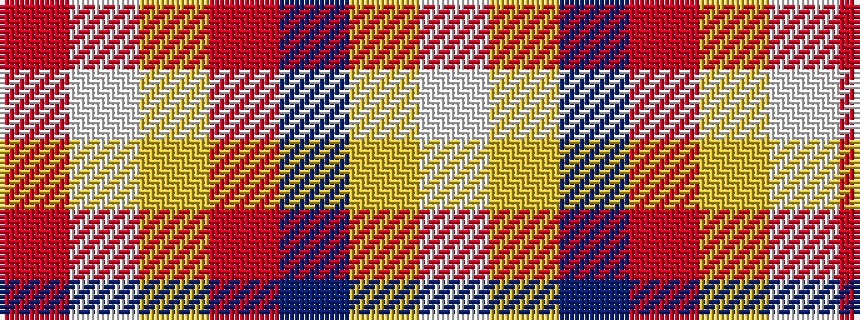

RWYRBYW

It is a 7 stripe tartan.

<figure class="pat-woven">

<figcaption>idealised sample</figcaption>
</figure>

## Colour Sequence



## Tartans with this colour sequence

| Tartans |
|---------------|
| [Susan G Komen 06](/setts/s7/w6lr27dr6o40lr44w8o4/)|
||
