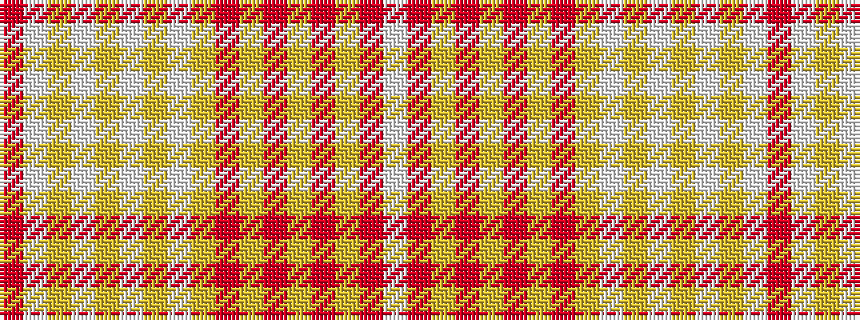

RWYWYWYWYRYRYRYRW

It is a 17 stripe tartan.

<figure class="pat-woven">

<figcaption>idealised sample</figcaption>
</figure>

## Colour Sequence



## Tartans with this colour sequence

| Tartans |
|---------------|
| [Nike Golf Light](/setts/s17/r5w20lr1w2lr1w2lr2w2lr5o2lr2o2lr2o3lr2o10w3~x2/)|
||
