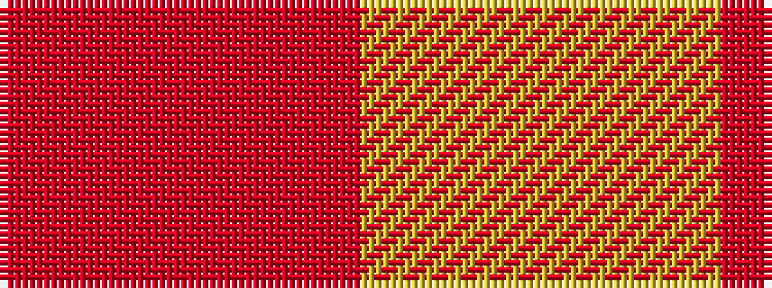

RY

It is a 2 stripe tartan.

<figure class="pat-woven">

<figcaption>idealised sample</figcaption>
</figure>

## Colour Sequence



## Tartans with this colour sequence

| Tartans |
|---------------|
| [Roddy "Rowdy" Piper (Personal)](/setts/s2/r9lr1~x20/)|
||
