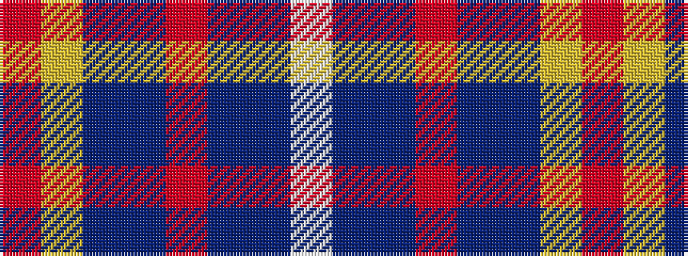

RYBBRBBW

It is a 8 stripe tartan.

<figure class="pat-woven">

<figcaption>idealised sample</figcaption>
</figure>

## Colour Sequence



## Tartans with this colour sequence

| Tartans |
|---------------|
| [Fulbright Foundation](/setts/s8/r3lr25dbi6db3r2t5db18w3~x2/)|
||
