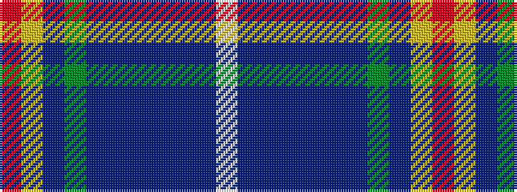

RYBGBBBBBBW

It is a 11 stripe tartan.

<figure class="pat-woven">

<figcaption>idealised sample</figcaption>
</figure>

## Colour Sequence



## Tartans with this colour sequence

| Tartans |
|---------------|
| [San Diego, The](/variants/s11/r2ly2db3dg30t8db3t2db3t2db16lb2~x2/)|
||
