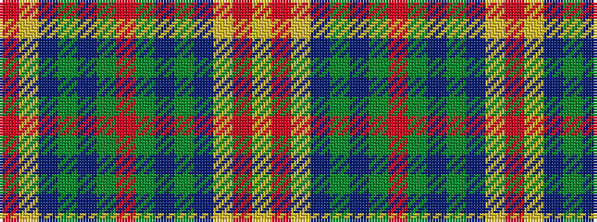

RYBGBGRGBGBYRY

It is a 14 stripe tartan.

<figure class="pat-woven">

<figcaption>idealised sample</figcaption>
</figure>

## Colour Sequence



## Tartans with this colour sequence

| Tartans |
|---------------|
| [New Mexico District Tartan Tartan Number: 2522. Earliest known date: 1995 The official state tartan for New Mexico which was designed in 1995 by Ralph L. Stevenson and included in his petition for the first US 'Tartan Day'. The rights of the tartan were placed in the public domain. Doubts were expressed for some time as to its perceived status but on 26th May 2003 the situation was clarified when Rebecca Vigil-Giron, Secretary of State for the State of New Mexico, issued a proclamation confirming that this was indeed the official state tartan. Woven by NGSI Woolen Mills of New Mexico. The history of the State of New Mexico Tartan began in 1995 when a wide cross section of New Mexico citizens with Scottish, Welsh, Irish, Manx, Spanish (Galician) Celtic ancestry, and Native American backgrounds gave their opinions and suggestions. The final design was created by Ralph L. Stevenson, Jr., a New Mexico citizen of Scottish descent, and woven by Jean Jones, a former Santa Fe textile artist who now resides in Asheville, North Carolina. The State Library was chosen as the permanent home for the display because of former Governor Garrey E. Carruthers' support of the New Mexico Tartan, his Scottish descent, and the naming of the library building after him approximately two years ago. Four colors are woven into the State of New Mexico Tartan -- Blue for the All Encompassing Sky, Green for the State's Plant Life and Forests, Red for the Original Cultural Providers, and Gold for the Minerals and Desert. See products available Copyright © Blair Urquhart, Comrie, 2015](/setts/s14/r1ly2db11g5db1g8r1g8db1g5db11ly2r1ly1~x4/)|
|![New Mexico District Tartan Tartan Number: 2522. Earliest known date: 1995 The official state tartan for New Mexico which was designed in 1995 by Ralph L. Stevenson and included in his petition for the first US 'Tartan Day'. The rights of the tartan were placed in the public domain. Doubts were expressed for some time as to its perceived status but on 26th May 2003 the situation was clarified when Rebecca Vigil-Giron, Secretary of State for the State of New Mexico, issued a proclamation confirming that this was indeed the official state tartan. Woven by NGSI Woolen Mills of New Mexico. The history of the State of New Mexico Tartan began in 1995 when a wide cross section of New Mexico citizens with Scottish, Welsh, Irish, Manx, Spanish (Galician) Celtic ancestry, and Native American backgrounds gave their opinions and suggestions. The final design was created by Ralph L. Stevenson, Jr., a New Mexico citizen of Scottish descent, and woven by Jean Jones, a former Santa Fe textile artist who now resides in Asheville, North Carolina. The State Library was chosen as the permanent home for the display because of former Governor Garrey E. Carruthers' support of the New Mexico Tartan, his Scottish descent, and the naming of the library building after him approximately two years ago. Four colors are woven into the State of New Mexico Tartan -- Blue for the All Encompassing Sky, Green for the State's Plant Life and Forests, Red for the Original Cultural Providers, and Gold for the Minerals and Desert. See products available Copyright © Blair Urquhart, Comrie, 2015 example sett](/setts/s14/r1ly2db11g5db1g8r1g8db1g5db11ly2r1ly1~x4/sett.png)|
