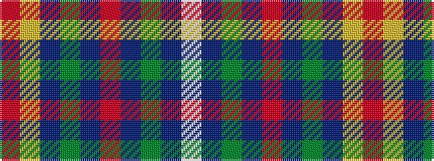

RYBGBRBGBW

It is a 10 stripe tartan.

<figure class="pat-woven">

<figcaption>idealised sample</figcaption>
</figure>

## Colour Sequence



## Tartans with this colour sequence

| Tartans |
|---------------|
| [Steve Walls](/variants/s10/r3ly1db15g16db3r6db6g8db15w3~x2/)|
||
| [Steve Walls Commemorative](/variants/s10/r3ly1db15dg16db3r6db6dg8db15w3~x2/)|
||
