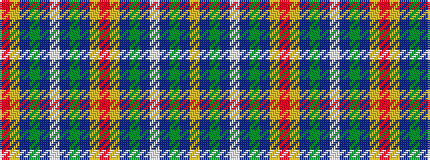

RYBGBWBGBYRYBGBWBGBY

It is a 20 stripe tartan.

<figure class="pat-woven">

<figcaption>idealised sample</figcaption>
</figure>

## Colour Sequence



## Tartans with this colour sequence

| Tartans |
|---------------|
| [Hirter Karo](/setts/s20/r3ly3db18dy15b16w3b16dy15b18ly3r3~x2/)|
||
