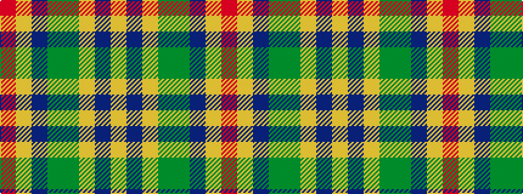

RYBGGYBY

It is a 8 stripe tartan.

<figure class="pat-woven">

<figcaption>idealised sample</figcaption>
</figure>

## Colour Sequence



## Tartans with this colour sequence

| Tartans |
|---------------|
| [Goddin mab Gododdin (Personal)](/variants/s8/r4lo3dt24dy26g3lo21dp2lo4~x2/)|
||
