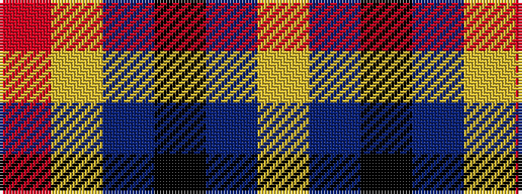

RYBKBY

It is a 6 stripe tartan.

<figure class="pat-woven">

<figcaption>idealised sample</figcaption>
</figure>

## Colour Sequence



## Tartans with this colour sequence

| Tartans |
|---------------|
| [CALA Homes](/setts/s6/ly5dbi24k8db18ly6o3/)|
||
