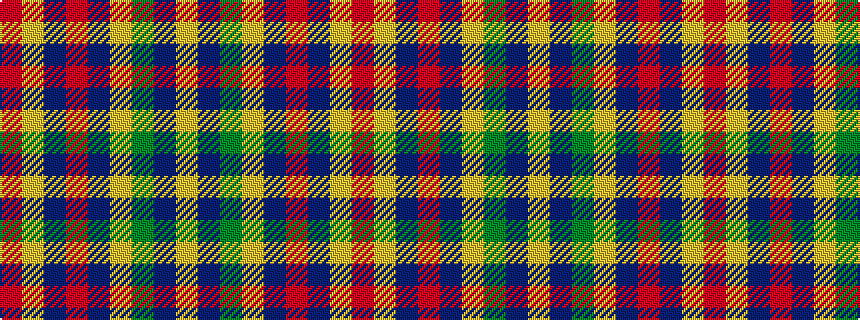

RYBRBYGBY

It is a 9 stripe tartan.

<figure class="pat-woven">

<figcaption>idealised sample</figcaption>
</figure>

## Colour Sequence



## Tartans with this colour sequence

| Tartans |
|---------------|
| [Isle of Arran (Personal)](/variants/s9/r1lo4dr3r1dr3lr1g3db3lr1~x4/)|
||
