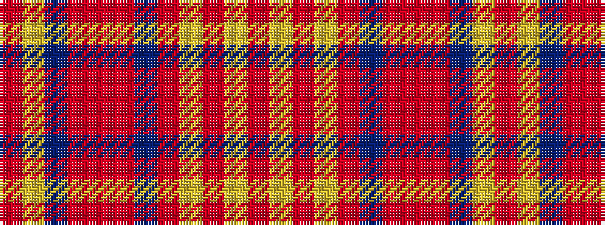

RYBRRRBRYRYR

It is a 12 stripe tartan.

<figure class="pat-woven">

<figcaption>idealised sample</figcaption>
</figure>

## Colour Sequence



## Tartans with this colour sequence

| Tartans |
|---------------|
| [Lakin (Personal)](/setts/s12/r5lr1r1lr1r1n5o6r1o6n5lr5r1~x4/)|
||
