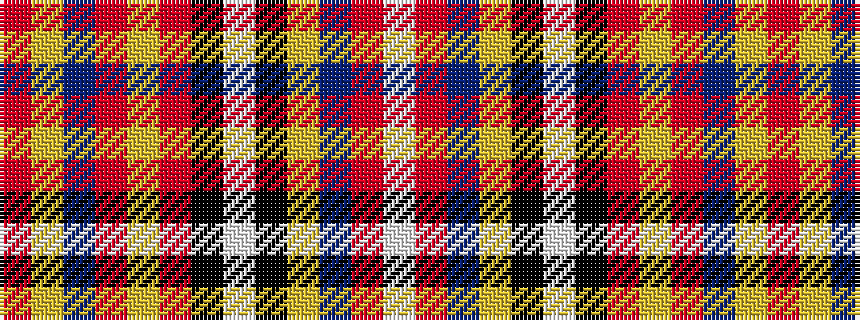

RYBRYRKWKYBRW

It is a 13 stripe tartan.

<figure class="pat-woven">

<figcaption>idealised sample</figcaption>
</figure>

## Colour Sequence



## Tartans with this colour sequence

| Tartans |
|---------------|
| [Robieson (Personal)](/setts/s13/r1lr1n8r1lr1r8k1w8k1lr1n8r1w1~x6/)|
||
