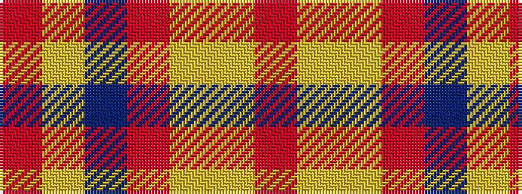

RYBRYYR

It is a 7 stripe tartan.

<figure class="pat-woven">

<figcaption>idealised sample</figcaption>
</figure>

## Colour Sequence



## Tartans with this colour sequence

| Tartans |
|---------------|
| [Cercle de Fermières de Saint-Élie d'Orford](/variants/s7/r2ly1b8r1lg7ly1r2~x6/)|
||
