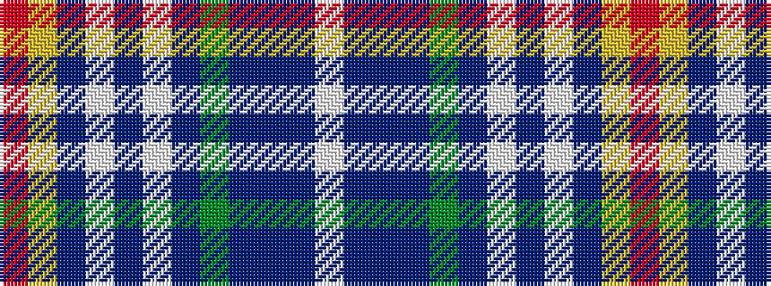

RYBWBWBGBBBW

It is a 12 stripe tartan.

<figure class="pat-woven">

<figcaption>idealised sample</figcaption>
</figure>

## Colour Sequence



## Tartans with this colour sequence

| Tartans |
|---------------|
| [Skye Highland Outfitters (Corporate)](/setts/s12/r25lo5db6lb2db2lb2db2g10dp10db1dp3lb2~x2/)|
||
