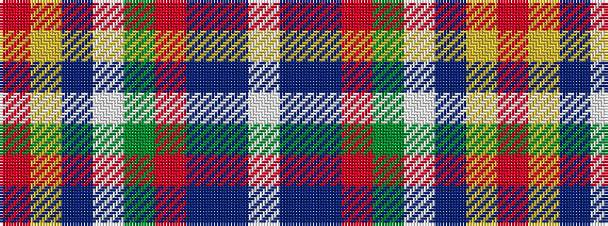

RYBWGRBBW

It is a 9 stripe tartan.

<figure class="pat-woven">

<figcaption>idealised sample</figcaption>
</figure>

## Colour Sequence



## Tartans with this colour sequence

| Tartans |
|---------------|
| [Drummond, Ancient](/variants/s9/r38ly1db3w1g13r6db3t3w1~x2/)|
||
