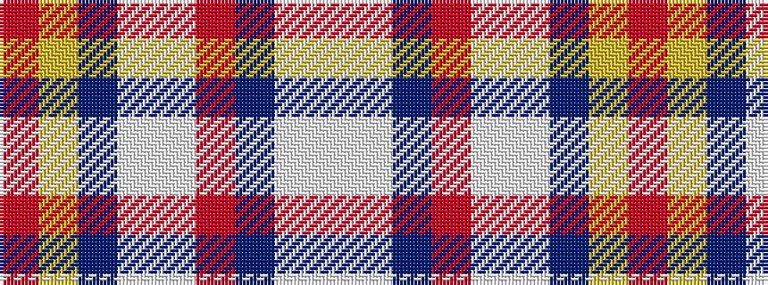

RYBWWRBWW

It is a 9 stripe tartan.

<figure class="pat-woven">

<figcaption>idealised sample</figcaption>
</figure>

## Colour Sequence



## Tartans with this colour sequence

| Tartans |
|---------------|
| [Drummond of Perth Dress #3](/setts/s9/r67ly3n6lb3w25r10n6lb7w3~x2/)|
||
