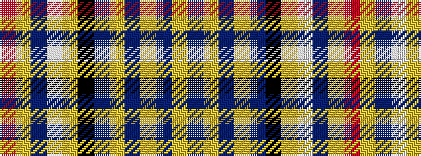

RYBWYKBYBYBY

It is a 12 stripe tartan.

<figure class="pat-woven">

<figcaption>idealised sample</figcaption>
</figure>

## Colour Sequence



## Tartans with this colour sequence

| Tartans |
|---------------|
| [Ruxton Dress](/setts/s12/r4ly4db9w3ly2k9db21ly2db2ly2db8ly3~x2/)|
||
| [Ruxton, dress](/setts/s12/m4ly4db9w3ly2k9db21ly2db2ly2db8ly3~x2/)|
||
