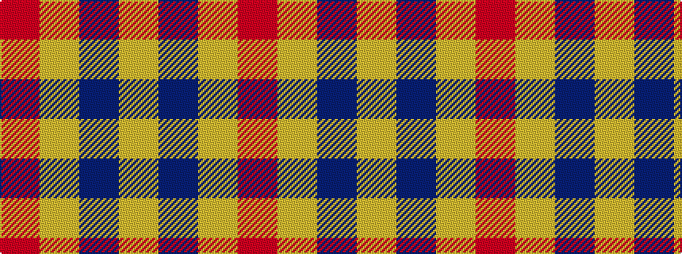

RYBY

It is a 4 stripe tartan.

<figure class="pat-woven">

<figcaption>idealised sample</figcaption>
</figure>

## Colour Sequence



## Tartans with this colour sequence

| Tartans |
|---------------|
| [Rabbie's Dram (Fashion)](/variants/s4/lo60do3lo4r3~x2/)|
||
