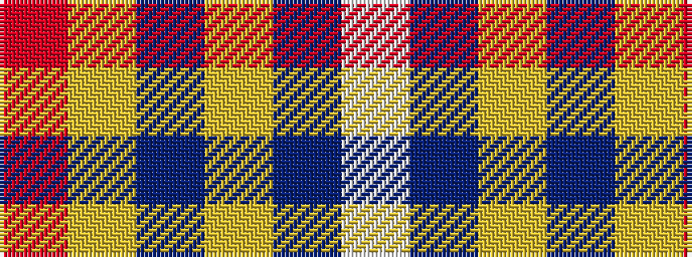

RYBYBW

It is a 6 stripe tartan.

<figure class="pat-woven">

<figcaption>idealised sample</figcaption>
</figure>

## Colour Sequence



## Tartans with this colour sequence

| Tartans |
|---------------|
| [Brock University Alumni Association](/setts/s6/r52lo2db16lo2db3w5~x2/)|
||
