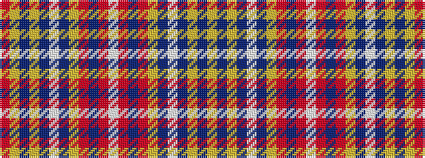

RYBYBWBYRBRWRBRYBWBYBY

It is a 22 stripe tartan.

<figure class="pat-woven">

<figcaption>idealised sample</figcaption>
</figure>

## Colour Sequence



## Tartans with this colour sequence

| Tartans |
|---------------|
| [Stuart/Stewart - Prince Charles Edward](/variants/s22/r14lg4dt6ly1dt2w2dt2lgi12r6dt2r2w1~x4/)|
||
