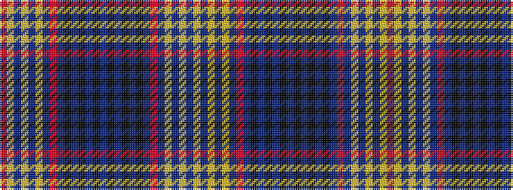

RYBYBYBRBKBKBKBKBKBKBRBYBYBY

It is a 28 stripe tartan.

<figure class="pat-woven">

<figcaption>idealised sample</figcaption>
</figure>

## Colour Sequence



## Tartans with this colour sequence

| Tartans |
|---------------|
| [Laing Clan/Family Tartan](/variants/s28/r1ly1b1ly3b1ly4b1r1b26k1b1ki4b1ki3b1ki3b1ki4b1k1b26r1b1ly4b1ly3b1ly1~x4/)|
||
