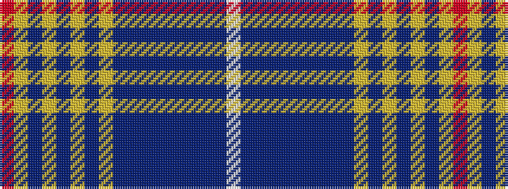

RYBYBYBYBBBBBBBBW

It is a 17 stripe tartan.

<figure class="pat-woven">

<figcaption>idealised sample</figcaption>
</figure>

## Colour Sequence



## Tartans with this colour sequence

| Tartans |
|---------------|
| [Pride of Lorient](/variants/s17/r2lr8n1lr4n2lr3n3lr1n15dt1n4dt2n2dt4n1dt9w2~x2/)|
||
