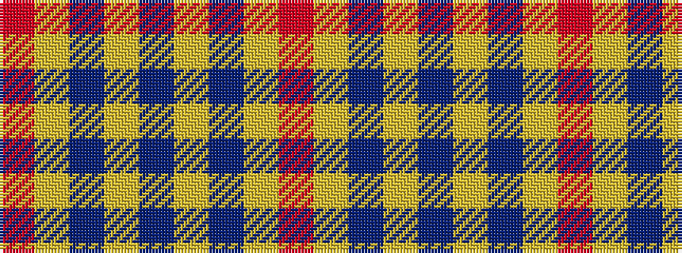

RYBYBYBYR

It is a 9 stripe tartan.

<figure class="pat-woven">

<figcaption>idealised sample</figcaption>
</figure>

## Colour Sequence



## Tartans with this colour sequence

| Tartans |
|---------------|
| [Burt #1 (Name)](/setts/s9/r2lo13b8lo3b33lg3b8lg13m2~x2/)|
||
