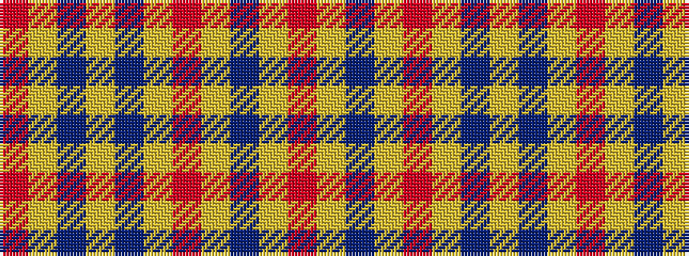

RYBYBYRYBYR

It is a 11 stripe tartan.

<figure class="pat-woven">

<figcaption>idealised sample</figcaption>
</figure>

## Colour Sequence



## Tartans with this colour sequence

| Tartans |
|---------------|
| [Morgan of Wales](/setts/s11/r4ly34do20ly4do8ly6r2ly5do2ly3r4/)|
||
