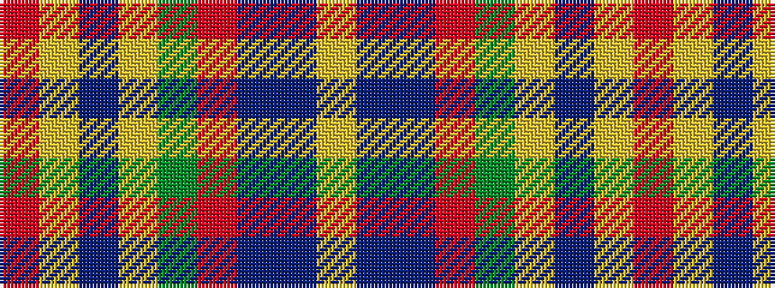

RYBYGRBBY

It is a 9 stripe tartan.

<figure class="pat-woven">

<figcaption>idealised sample</figcaption>
</figure>

## Colour Sequence



## Tartans with this colour sequence

| Tartans |
|---------------|
| [Drummond of Perth](/tartans/r36lr1db3ly1dg16r8db3b2lr1/)|
||
