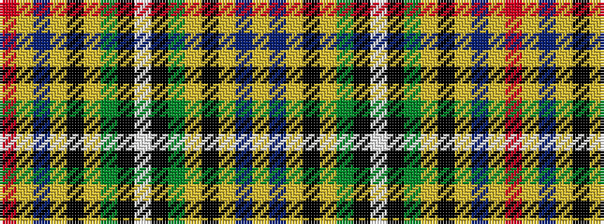

RYBYKYGKWKGYKYBY

It is a 16 stripe tartan.

<figure class="pat-woven">

<figcaption>idealised sample</figcaption>
</figure>

## Colour Sequence



## Tartans with this colour sequence

| Tartans |
|---------------|
| [Stirling](/variants/s16/r2lr2b20lr2k13lr2g20k2lb4k2g20lr2k13lr2b20lr2~x2/)|
||
