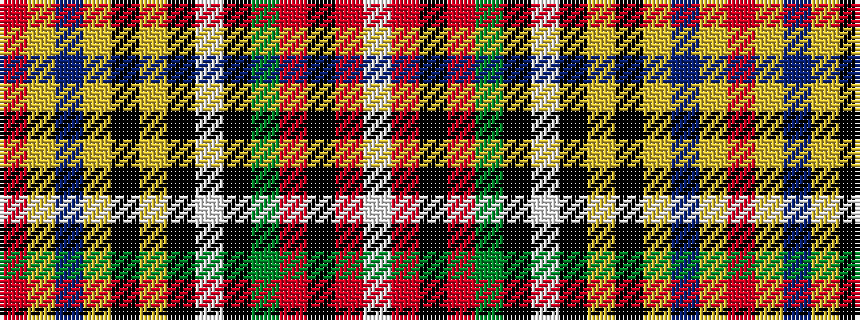

RYBYKYKWKGRKRW

It is a 14 stripe tartan.

<figure class="pat-woven">

<figcaption>idealised sample</figcaption>
</figure>

## Colour Sequence



## Tartans with this colour sequence

| Tartans |
|---------------|
| [Victoria (Yellow)](/setts/s14/r6ly60db12ly6k12ly2k2w2k2g18r18k3r4w2~x2/)|
||
