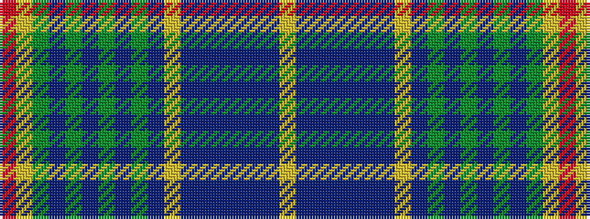

RYGBGBGBGBYBBBBBBY

It is a 18 stripe tartan.

<figure class="pat-woven">

<figcaption>idealised sample</figcaption>
</figure>

## Colour Sequence



## Tartans with this colour sequence

| Tartans |
|---------------|
| [Glaz](/setts/s18/r2ly1y7t1y4t2y3t3y1t15lr1t4dt2t2dt4t1dt9lr2~x2/)|
||
