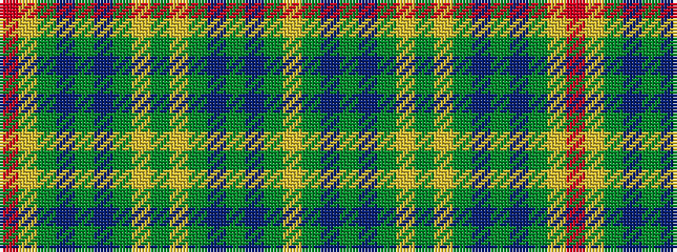

RYGBGBGYGYGBGBGY

It is a 16 stripe tartan.

<figure class="pat-woven">

<figcaption>idealised sample</figcaption>
</figure>

## Colour Sequence



## Tartans with this colour sequence

| Tartans |
|---------------|
| [Nova Scotia Dress #2](/variants/s16/ly5g16db8g4db4g4lr38g4lr38g4db4g4db8g16ly5r3~x2/)|
||
