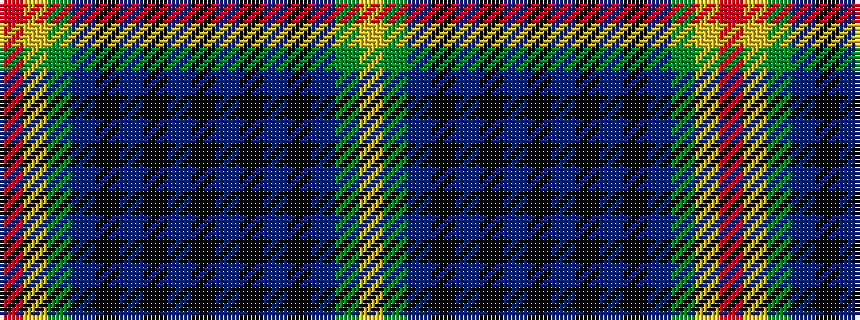

RYGBKBKBKBKBKBGY

It is a 16 stripe tartan.

<figure class="pat-woven">

<figcaption>idealised sample</figcaption>
</figure>

## Colour Sequence



## Tartans with this colour sequence

| Tartans |
|---------------|
| [Falkirk District Tartan](/variants/s16/k4b4k2b4k2b22dy27ly2r3~x2/)|
||
