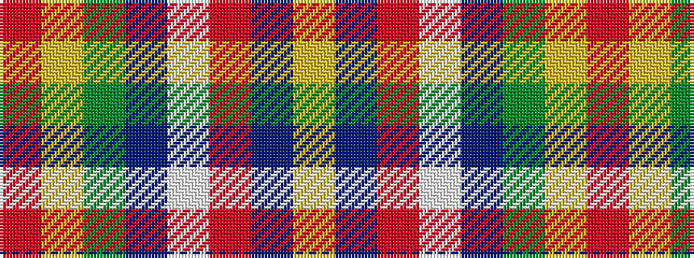

RYGBWRBY

It is a 8 stripe tartan.

<figure class="pat-woven">

<figcaption>idealised sample</figcaption>
</figure>

## Colour Sequence



## Tartans with this colour sequence

| Tartans |
|---------------|
| [Round Table Sweden](/setts/s8/r3lo15g4t6w2r30t6ly3~x2/)|
||
| [Round Table Sweden](/setts/s8/r3lo15g4dt6w2r30dt6ly3~x2/)|
||
